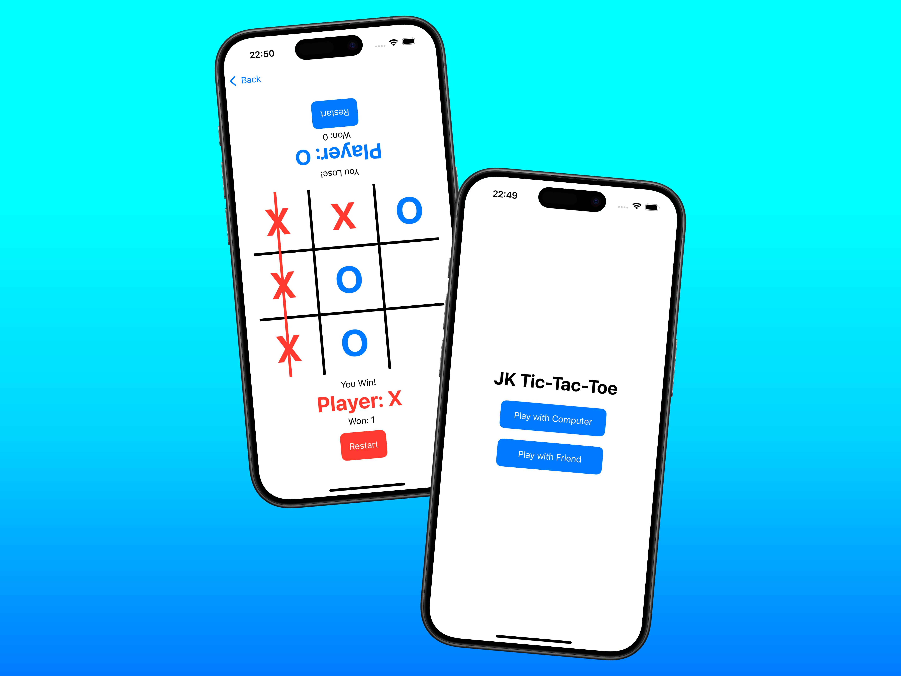

# JK Tic-Tac-Toe

A fun and interactive **iOS Tic-Tac-Toe game** built with **Swift** and **SwiftUI**, offering both **multiplayer gameplay** and **computer mode**.



## Features
- **Multiplayer Mode**: Play with a friend in **2-player mode**.
- **Computer Mode**: Challenge the AI for a solo gaming experience.
- **Smooth UI**: Designed with SwiftUI for an intuitive user experience.
- **Responsive Gameplay**: Fast and efficient game logic for seamless play.

## Installation
1. Clone the repository:
   ```sh
   git clone https://github.com/janakkhadka/TicTacToe-SwiftUI
   ```
2. Open the project in Xcode.
3. Build and run on a simulator or a physical device.

## Contributing
Pull requests are welcome. For major changes, please open an issue to discuss modifications.


## Contact
For any inquiries, reach out via janakkhadka08@gmail.com.


## 🌟 Star the Project

If you find this project useful or interesting, please consider giving it a **star** on GitHub! Your support helps motivate further development and improvements.

[](https://github.com/janakkhadka/TicTacToe-SwiftUI/stargazers)

Click the button above or simply go to the repository and click the **Star** button at the top right. Thank you! 🚀

